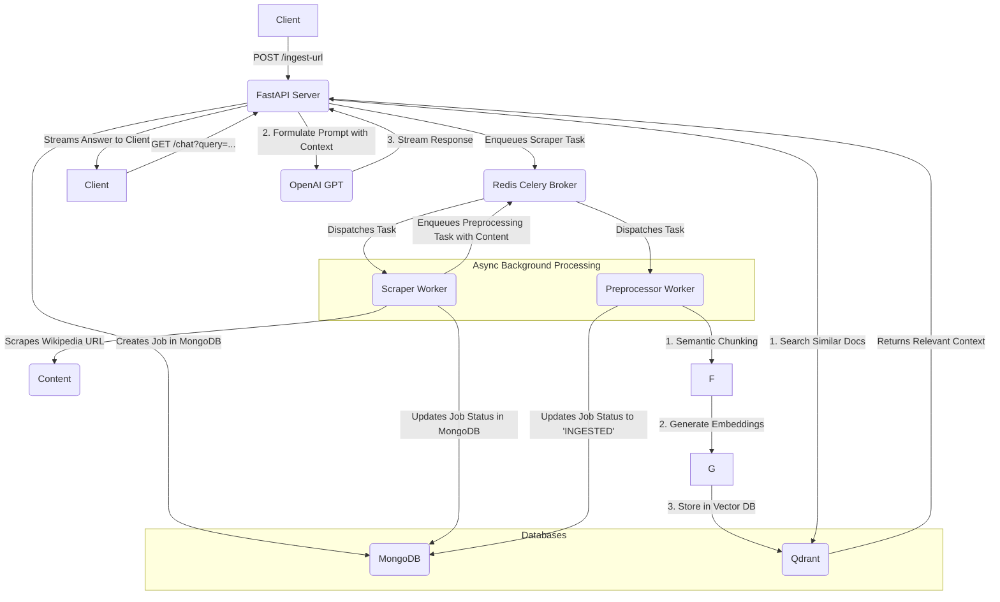

# Aira AI Assessment

This project implements a Retrieval-Augmented Generation (RAG) system designed to answer questions based on content scraped from Wikipedia pages. It features a microservices-style architecture with a FastAPI server for handling API requests and two Celery workers for asynchronous web scraping and data preprocessing.

## Architecture

The system is composed of three main services that communicate via a Redis message broker:

1.  **FastAPI Server (`/server`)**: The main entry point for users. It exposes REST API endpoints for ingesting Wikipedia URLs, checking the status of ingestion jobs, and a chat interface to ask questions about the ingested content.

2.  **Scraper Worker (`/scrapper-worker`)**: A Celery worker that listens for scraping tasks. When it receives a URL, it fetches the page content using `requests` and parses the main text with `BeautifulSoup`. Upon successful scraping, it queues a preprocessing task.

3.  **Preprocessor Worker (`/preprocessor-worker`)**: A Celery worker that processes the text content provided by the scraper. It uses `langchain_experimental.text_splitter.SemanticChunker` to split the text into meaningful chunks. It then generates embeddings for these chunks using the `mixedbread-ai/mxbai-embed-large-v1` model and stores them in a Qdrant vector database.

### Data and Task Flow



## Features

-   **Asynchronous URL Ingestion**: Non-blocking API to submit URLs for processing.
-   **Job Status Tracking**: Track the state of each ingestion task (`PENDING`, `SCRAPPED`, `INGESTED`, `FAILED`).
-   **Semantic Chunking**: Splits text based on semantic meaning, providing better context for the RAG system.
-   **Vector Search**: Uses Qdrant for efficient similarity searches on text embeddings.
-   **Streaming Chat Responses**: The chat API streams the AI's response token by token for an improved user experience.
-   **Microservice Architecture**: Decoupled services for scraping, preprocessing, and serving the API, enabling independent scaling and maintenance.

## Technology Stack

-   **Backend**: Python, FastAPI
-   **Task Queuing**: Celery
-   **AI / LLM**: LangChain, OpenAI, Hugging Face Transformers (`sentence-transformers`)
-   **Databases**:
    -   **Qdrant**: Vector database for storing text embeddings.
    -   **MongoDB**: Document store for tracking job statuses.
    -   **Redis**: Message broker for Celery and caching.
-   **Web Scraping**: BeautifulSoup4, Requests

## Setup and Installation

### Prerequisites

-   Python 3.10+
-   Docker and Docker Compose
-   An OpenAI API Key

### 1. Clone the Repository

```bash
git clone https://github.com/ayushrawat-cmd/aira-ai-assesment.git
cd aira-ai-assesment
```

### 2. Set Up Infrastructure with Docker

The project requires Redis and Qdrant instances. You can start them easily using Docker.

```bash
# Start Redis
docker run -d --name redis-local -p 6379:6379 redis:7-alpine

# Start Qdrant
docker run -d --name qdrant-local -p 6333:6333 -v "$(pwd)/qdrant_data:/qdrant/storage" qdrant/qdrant:latest
```

### 3. Environment Variables

Create a `dev.env` file in the root of the `scrapper-worker`, `preprocessor-worker`, and `server` directories. Populate it with the necessary credentials.

**Example `dev.env` file:**

```env
MONGODB_URI="mongodb://localhost:27017/"
GPT_API_KEY="your-openai-api-key"
GPT_ORG_ID="your-openai-organization-id"
```

### 4. Install Dependencies

Install the required Python packages for each service in separate terminal sessions.

```bash
# Terminal 1: Server
cd server
pip install -r requirements.txt

# Terminal 2: Scraper Worker
cd scrapper-worker
pip install -r requirements.txt

# Terminal 3: Preprocessor Worker
cd preprocessor-worker
pip install -r requirements.txt
```

### 5. Run the Application

Start the services in the following order:

1.  **Start the Celery Workers** (in their respective terminals):

    ```bash
    # In the scrapper-worker directory
    celery -A main worker --loglevel=info -Q scraper_queue --concurrency=1

    # In the preprocessor-worker directory
    celery -A main worker --loglevel=info -E -Q preprocess_queue --concurrency=1
    ```

2.  **Start the FastAPI Server** (in its terminal):

    ```bash
    # In the server directory
    uvicorn main:app --host 0.0.0.0 --port 5001 --reload
    ```

The API server will be available at `http://localhost:5001`.

## API Endpoints

The API documentation is available at `http://localhost:5001/docs` after starting the server.

### Ingest a URL

-   **Endpoint**: `POST /api/v1/aira/ingest-url`
-   **Description**: Submits a Wikipedia URL to be scraped and indexed.
-   **Status Code**: `202 ACCEPTED`
-   **Request Body**:
    ```json
    {
      "url": "https://en.wikipedia.org/wiki/Retrieval-augmented_generation",
      "email": "user@example.com"
    }
    ```
-   **Response Body**:
    ```json
    {
      "req_status": "success",
      "task_id": "e7b0e2b0-5f0c-11ef-8f74-acde48001122"
    }
    ```

### Get Job Status

-   **Endpoint**: `GET /api/v1/aira/job-status`
-   **Description**: Retrieves the status of an ingestion job using the `task_id`.
-   **Query Parameters**:
    -   `task_id` (string, required)
-   **Response Body**:
    ```json
    {
        "_id": "e7b0e2b0-5f0c-11ef-8f74-acde48001122",
        "url": "https://en.wikipedia.org/wiki/Retrieval-augmented_generation",
        "email": "user@example.com",
        "status": "INGESTED",
        "created_at": "2024-08-28T10:00:00.000Z",
        "updated_at": "2024-08-28T10:05:00.000Z"
    }
    ```

### Chat with the System

-   **Endpoint**: `GET /api/v1/aira/chat`
-   **Description**: Ask a question about the ingested content. The response is streamed.
-   **Query Parameters**:
    -   `query` (string, required)
-   **Response**: A `text/event-stream` response with JSON objects.
    ```
    event: data
    data: {"event":"data","data":"Retrieval"}

    event: data
    data: {"event":"data","data":"-augmented"}

    event: data
    data: {"event":"data","data":" generation"}

    ...
    ```

### Get Relevant Documents

-   **Endpoint**: `GET /api/v1/aira/relevant-docs`
-   **Description**: Retrieves the most relevant text chunks from the vector database for a given query without running the LLM.
-   **Query Parameters**:
    -   `query` (string, required)
-   **Response Body**:
    ```json
    {
      "documents": [
        {
          "page_content": "A key component of RAG is the retriever, which finds and returns documents relevant to the input query...",
          "metadata": {
            "title": "Retrieval-augmented generation",
            "url": "https://en.wikipedia.org/wiki/Retrieval-augmented_generation"
          }
        }
      ]
    }
    ```

### Health Check

-   **Endpoint**: `GET /api/v1/aira/health-check`
-   **Description**: A simple endpoint to verify that the server is running.
-   **Response**: `"Chatbot service is working."`